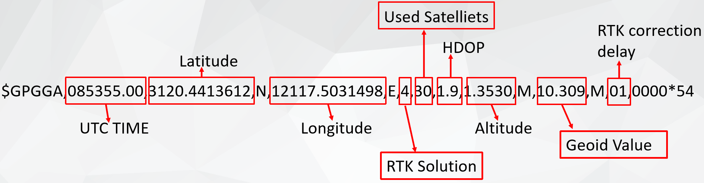
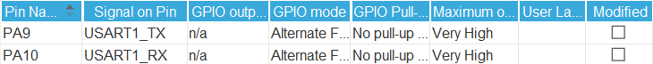
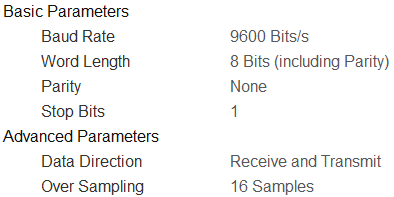
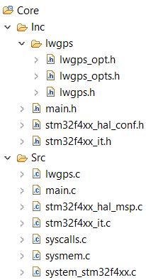
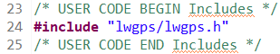
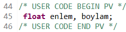
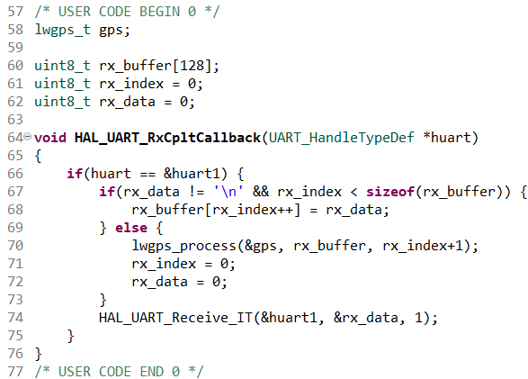
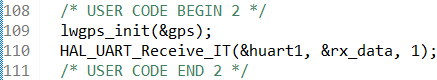
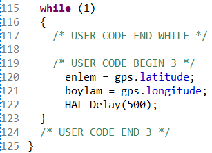

# Sıcaklık Ölçümü

> ## **NTC**

## Giriş
Örnek uygulamamızı [linkteki](https://youtu.be/4DsScjJ3h_I) videodan referans alarak yapıyoruz.<br>
İsterseniz [makaleden]( https://milisaniye.home.blog/2020/10/05/stm32-neo-6m-gps-uygulamasi/) yararlanabilirsiniz. Kullanılan kütüphaneye [linkten](https://github.com/leech001/gps/blob/master/src/gps.c) ulaşabilrisiniz.<br>
[Link](http://aprs.gids.nl/nmea/) üzerinden NMEA protokolün $GPxxxx ile başlayan 19 farklı veri kodu hakkında bilgi alabiliriz.<br>
Kullanılan kütüphanelerde GPS çalıştırırken Interrupt aktif edilmesi gerekir.


## Teori
GPGGA veri kodu hakkında bilgi edinmek için [birinci](https://ozcanfatih.wordpress.com/2016/07/24/nmea-0183-protokolu-ve-gps-verisi-ayiklama/) ile [ikinci]( https://docs.novatel.com/OEM7/Content/Logs/GPGGA.htm) makaleden yararlanabiliriz. <br>

 <br>
1. veri mesajın ID'sini temsil eder ve daha sonrası her biri virgül ile ayrılmış toplamda 15 veri vardır.<br>
2. veri pozisyonun zamanını veriri. Formatında saat, dakika, saniye, milisaniye verilerini içerir.<br>
3. ve 4. veri enlem bilgisi ile yönünü verir. <br>
5. ve 6. veri boylam bilgisini verir. <br>
7. veri konum kalitesini gösterir. 1-9 arasında değer alır.<br>
8. veri uydusu sayısı verir.<br>
9. veri konum hassasiyetini verir.<br>
10. ve 11. veri irtifa verisini ve hangi birimde olduğunun bilgisini verir.<br>
12. ve 13. veri geoit değerinim verisini ve hangi birimde olduğunun bilgisini verir.<br>
14. veri ile verinin düzeltme yaşını verir. 1-99 arasında değer alır.<br>
15. veri diferansiyel referans istasyon ID değerini verir.<br>
16. veri * işareti ile birlikte checksum değerini verir.<br>


## Konfigürasyon Kısmı
 <br>
 <br>
USART1 için Asynchronous seçimi yapılır. Baude Rate 9600 seçilir. <br>
 <br>
GPS, Interrupt ile kullanıldığından USART1 için NVIC Settings kısmından İnterrupt Enabled yapılır.<br>
 


## Kod Kısmı
Gps kütüphanesi için gerekli kütüphaneleri ekliyoruz. Lwgps dosyası içerisinde lwgps.h, lwgps_opt.h ve lwgps_opts.h dosyalarını içeriyor. Bu dosyalar Inc klasörü içerisine ekliyoruz. Lwgps.c kütüphanesini Src klasörüne ekliyoruz.<br>
Daha sonra main.c dosyasına  lwgps.h dosyasını ekliyoruz.<br>
 <br>
 <br>
 <br>
 <br>
 <br>
 <br>

Eğer gps.h ve gps.c kütüphanesini kullanmak istersek konfigürasyon kısmında değişiklik yapmadan main.c dosyasını aşağıdaki gibi düzeltilir.
```c
#include "main.h"
#include "gps.h"

UART_HandleTypeDef huart1;

float enlem, boylam;

void SystemClock_Config(void);
static void MX_GPIO_Init(void);
static void MX_USART1_UART_Init(void);

void HAL_UART_RxCpltCallback(UART_HandleTypeDef *huart)
{
	  GPS_CallBack();
}

int main(void)
{
  HAL_Init();

  SystemClock_Config();

  MX_GPIO_Init();
  MX_USART1_UART_Init();

  GPS_Init();

  while (1)
  {
      GPS_Process();
      HAL_Delay(500);
  }
}
``` 

---
<br>

